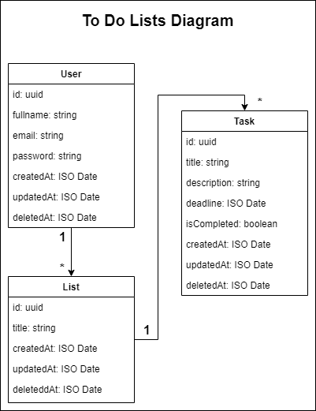

# Practice API with Events Node

  

    To do lists API uses Node events to process information
  

## 🎯 Conditions

- Utilize Node events
- Use TypeScript while structuring the different entities
- It should allow to do the basic CRUD operations

## 🗺️ Diagram

